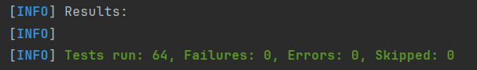

## Установка и запуск

## Архитектура
В этом проекте я написал CLI приложение, как и было указано в ТЗ.  
Соответственно, взаимодействие с пользователем происходит через консоль.  
По умолчанию после выхода данные приложения сохраняются в директории проекта в папке `./data` (но это можно настроить в application.properties)  
Во время сессии данные хранятся в оперативной памяти приложения в TreeMap.  

Структура "БД":
1. users.json - хранит список всех пользователей (id, username, password)
2. categories/expenses - хранит файлы с названием `{user_id}.json`.  
   В каждом файле содержится список расходных категорий соответствующего пользователя (id, name, budget)
3. categories/incomes - хранит файлы с названием `{user_id}.json`.
   В каждом файле содержится список доходных категорий соответствующего пользователя (id, name)
4. operations/expenses - хранит файлы с названием `{user_id}.json`.
   В каждом файле содержится список расходов соответствующего пользователя (id, amount, category_id)
5. operations/incomes - хранит файлы с названием `{user_id}.json`.
   В каждом файле содержится список доходов соответствующего пользователя (id, amount, category_id)

Сущности:
1. User. Представляет собой информацию о пользователе. Хранит id, имя пользователя и пароль.  
   Также по требованиям ТЗ к каждому пользователю должен быть привязан кошелёк с операциями и балансом, что я тоже реализовал, хотя это не совсем вписывается в конкретно мою архитектуру.
2. Category (ExpenseCategory и IncomeCategory). Представляет собой информацию о категории. Хранит id, название категории и, для расходных, бюджет.
3. Operation (ExpenseOperation и IncomeOperation). Представляет собой информацию об операции (расходе или доходе).  
   Хранит id, сумму операции и ссылку на категорию (расходную или доходную соответственно).
4. Все сущности являются наследниками абстрактного класса Entity.

Основные слои:
1. repository - репозитории используются для хранения данных в оперативной памяти и реализации с ними CRUD-операций.  
   Все репозитории наследуются от абстрактного EntityRepository, который реализует интерфейс CrudRepository.
2. service - сервисы используются для реализации бизнес-логики (например, расчёт общей суммы операций по категории) и вызывают под капотом репозитории и другие сервисы.  
   Также используются для загрузки данных в оперативную память и сохранении в "БД" и экспорта/импорта в файл/из файла.
   За исключением MigrationService, все сервисы наследуются от EntityService.
3. cli - CLI используются для взаимодействия с пользователем через консоль, в них осуществляется управление "флоу" приложения и первичная валидация ввода.

Использованные технологии:
1. Spring Boot - для DI и IoC, а также для упрощения конфигурации приложения и сборки итогового jar
2. Jackson (через ObjectMapper) - для сериализации и десериализации сущностей
3. Spring Testing, JUnit, Mockito - для написания модульных и интеграционных тестов

## Примеры команд
При запуске вам будет доступно меню входа.  
Если до этого вы не создавали пользователя, то выберите (здесь и далее - введите в консоль соответсвующее число) пункт "2.  Зарегистрироваться", затем укажите желаемые имя пользователя и пароль.  
Далее выберите пункт "3.  Войти", снова введите учётные данные зарегистрированного пользователя, и вы окажетесь в главном меню.  
Затем вы можете выбрать "2.  Доходные категории" и перейти в меню доходных категорий, потом пункт "3.  Добавить доходную категорию" и указать желаемое название категории.  
Далее вернитесь в главное меню, выберите пункт "4.  Доходы", потом "3.  Добавить новый доход ". Там вы увидите список с добавленной вами недавно категорией.  
Введите её ID (который должен быть 1) и сумму дохода, и доход добавлен. Обратите внимание, что привязать доход к несуществующей категории не получится (то есть сначала надо создать категорию, чтобы за ней закрепился определённый id).   
Затем вы можете выбрать "4.  Общий доход" и убедиться, что он совпадает с введёнными вами данными.  

Вообще я постарался сделать всё взаимодействие и получаемые ошибки максимально интуитивно понятными :)  

В главном меню вы также можете выбрать "6.  Экспорт/импорт данных", затем "3.  Импорт данных", ввести "да" и в качестве пути указать "./data.json".  
Это импортирует из файла data.json в корне проекта несколько уже заранее созданных категорий и расходов/доходов.

## Тестирование
  
Всего было написано 64 тестов, из которых 3 - интеграционные (пакет integration), 61 - модульные.  

Все тесты проходят успешно, в чём можно убедиться, использовав следующую команду:
```bash
./mvnw test
```

Надеюсь, вам понравится моё приложение, я правда старался и делал сам :)  
К сожалению, на тесты, автоматизацию, README и прочее времени оставалось немного :(